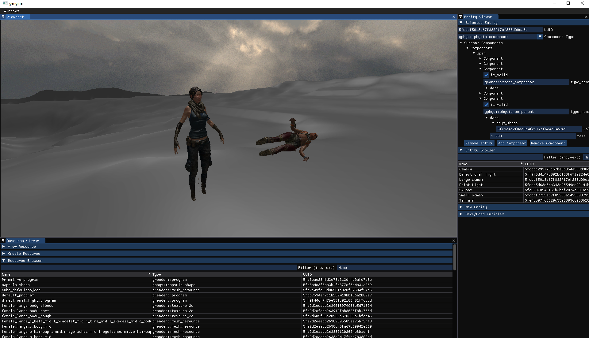

# GEngine
A small WIP ECS engine

## How to compile:
1. Require Visual Studio 2019
1. Require [VCPKG](https://github.com/microsoft/vcpkg)
1. Move vcpkg_setup.bat to VCPKG directory and run to setup dependency
1. Open gengine.sln and compile
	
## Current Features:
- [Small Entity - Component - System](gengine_lib/src/gcore/entity_registry.h)
- [Threaded resource loading with automatic hot reload](gengine_lib/src/gcore/resource_library.h)	
- [Flexible serialization using double dispatch visitor](gengine_lib/src/gserializer/serializer.h)
- [Basic deffered shading rendering pipeline (OpenGL)](gengine_lib/src/grender/systems/render_system.h) 	
- [Simple Bullet3 integration for physics](gengine_lib/src/gphys/systems/physic_systems.h)
- ImGUI based tool
	
## Current State
